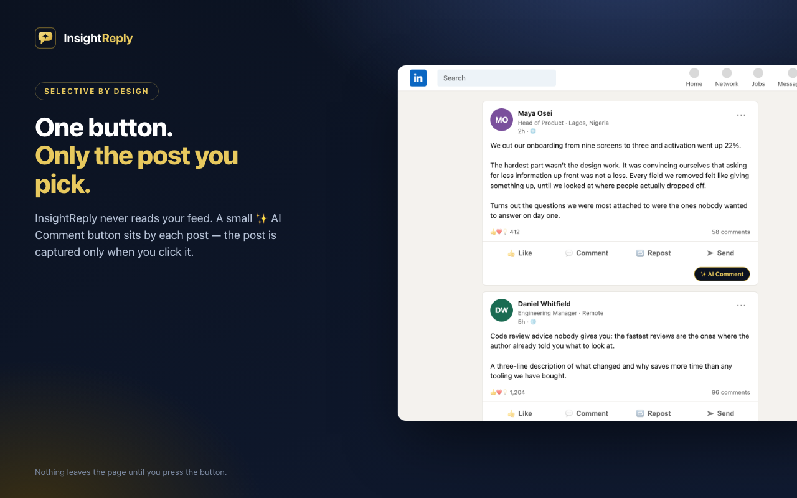
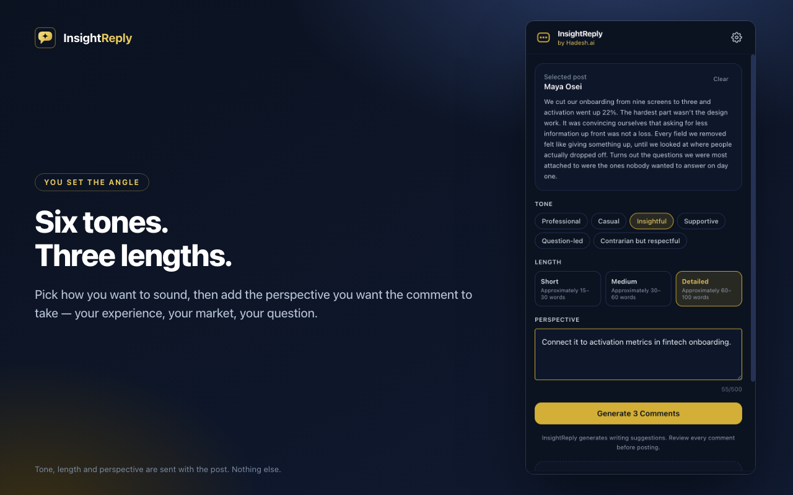
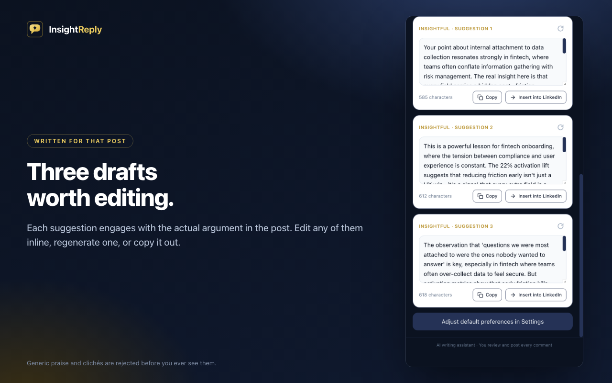
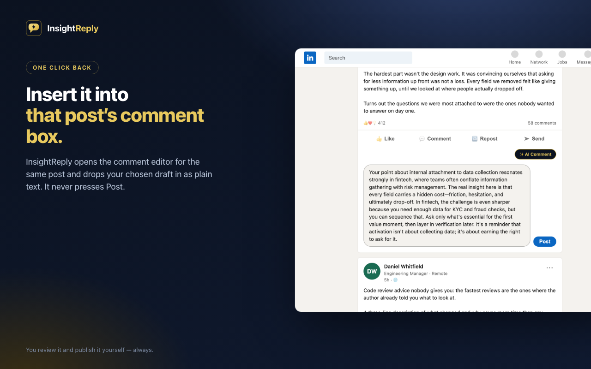

InsightReply is an AI-powered Chrome extension that helps you write thoughtful, relevant comments on LinkedIn posts. It reads **only** the post you deliberately select, understands its topic and context, and generates natural comment suggestions in different styles — ready for you to review, edit, and post yourself.

> InsightReply generates writing suggestions. Review every comment before posting.

---

## 1. Product overview

- **Selective by design.** The extension never reads your feed. A small `✨ AI Comment` button appears next to each post's engagement controls; the post is only extracted when you click it.
- **Three suggestions at a time**, in six tones (Professional, Casual, Insightful, Supportive, Question-led, Contrarian but respectful) and three lengths.
- **Full user control.** Edit, copy, regenerate, or insert a suggestion into the same post's comment editor. Nothing is ever submitted or posted automatically.
- **Private by default.** Only the selected post + your preferences are sent to your own backend, which forwards them to the AI provider. No databases, no retention, no cookies, no profile crawling.

## 2. Screenshots & demo

| | |
|---|---|
|  |  |
|  |  |

**[▶ Watch the 65-second demo](assets/demo/insightreply-demo.mp4)** — select a post, choose a tone and
length, generate, and insert the result into that post's comment box.

Everything above was captured from the real extension, service worker, side panel and backend. The
feed is a synthetic page (`assets/demo/demo-feed.html`) built from LinkedIn's own DOM structure and
served at a `linkedin.com` URL, so the genuine content script runs and no third-party posts or
account data appear in any asset.

### Assets

```text
assets/
  brand/    insightreply-mark.svg, insightreply-lockup.svg
  store/    1280x800 screenshots, promo tiles, 128px icon, raw/ source captures
  demo/     insightreply-demo.mp4, demo-poster.png, demo-feed.html
```

| Asset | Size | Chrome Web Store use |
|---|---|---|
| `assets/store/screenshot-0*.png` | 1280×800 | Listing screenshots (up to 5) |
| `assets/store/promo-small-440x280.png` | 440×280 | Small promo tile |
| `assets/store/promo-marquee-1400x560.png` | 1400×560 | Marquee tile (homepage featuring) |
| `assets/store/icon-128.png` | 128×128 | Store icon |

Rebuild the framed images after a copy or branding change:

```bash
pnpm store:assets
```

It composes them from `assets/store/raw/` (committed UI captures) plus the brand SVG, so no backend
or browser session is needed. Re-shoot `raw/` only when the UI itself changes. Confirm the required
sizes in the Developer Dashboard before uploading — Google adjusts them occasionally.

The extension's own PNG icons come from `apps/extension/scripts/generate-icons.mjs` (`pnpm icons`),
which redraws the mark in pure Node. Edit the SVG and that script together so they stay in sync.

## 3. Architecture

```
┌──────────────────────────────┐      chrome.runtime messages       ┌──────────────────────┐
│  LinkedIn page (content      │ ◄──────────────────────────────►  │  Service worker      │
│  script: button injection,   │   IR_SELECT_POST /               │  stores selected      │
│  extraction, insertion)      │   IR_INSERT_COMMENT              │  post (session),      │
└──────────────┬───────────────┘                                  │  opens side panel,    │
               │                                                  │  relays inserts       │
               │                                                  └──────────┬───────────┘
               │                                                             │
               │ chrome.storage.session (selected post)                      │ chrome.storage.sync (settings)
               │                                                             ▼
┌──────────────▼───────────────────────────────────────────────┐   ┌──────────────────────┐
│  Side panel (React)                                          │   │  Backend (Fastify)   │
│  - previews selected post                                    │   │  POST /v1/comments/  │
│  - tone / length / perspective pickers                       │  │  generate            │
│  - generates + validates via backend                         │   │  - Zod validation    │
│  - copy / insert / regenerate                                │   │  - rate limiting     │
└──────────────────────────────────────────────────────────────┘   │  - quality gates      │
                                                                   └──────────┬───────────┘
                                                                              │ OpenAI SDK
                                                                              ▼
                                                                       OpenAI Responses API
                                                                       (gpt-5 by default)
```

The **shared package** (`packages/shared`) holds the Zod schemas and message contract used by both the extension and the backend, so request/response validation is identical on both sides.

## 4. Repository structure

```text
insightreply/
  apps/
    extension/          # Chrome MV3 extension (React + Vite + Tailwind)
      src/
        background/     # service worker: session storage, side panel, relay
        content/        # content script: adapter, button, insertion, observer
          linkedin/
            selectors.ts# ALL LinkedIn DOM selectors (single maintenance point)
        sidepanel/      # React side-panel UI (state, components, views)
        test/           # test setup, fixtures, shared unit tests
      test/smoke/       # Playwright browser-level smoke test
      scripts/          # build / icons / packaging scripts
    api/                # Fastify backend (OpenAI Responses API)
      src/
        ai/             # prompt building, quality gates, generator
        routes/         # /health, /v1/comments/generate
  packages/
    shared/             # Zod schemas, types, message protocol
  assets/               # brand marks, Chrome Web Store images, demo video
  docs/                 # privacy, permissions, selector maintenance, store checklist
  dist/                 # insightreply-extension.zip (packaging output)
```

## 5. Requirements

- Node.js **20.11+** (tested on Node 24)
- pnpm **9+**
- A Chrome/Chromium browser (for the extension)
- An OpenAI API key (for the backend)
- Playwright browsers, only for the smoke test: `pnpm exec playwright install chromium`

## 6. Installation

```bash
git clone <your-repo-url> insightreply
cd insightreply
pnpm install
```

## 7. Environment variables

Copy `apps/api/.env.example` to `apps/api/.env`:

```bash
cp apps/api/.env.example apps/api/.env
```

```env
OPENAI_API_KEY=sk-...            # required — server-side only
OPENAI_MODEL=gpt-5               # any model supporting the Responses API
PORT=8787
ALLOWED_EXTENSION_ORIGIN=        # e.g. chrome-extension://<your-extension-id>
RATE_LIMIT_MAX=30
RATE_LIMIT_WINDOW=60000
TRUST_PROXY=false
LOG_LEVEL=info
```

The API key is **never** present in extension source, the manifest, browser storage, frontend environment variables, built bundles, or git history (`.env` is gitignored).

## 8. Starting the backend

```bash
pnpm dev:api        # watches and restarts on change
# or
pnpm --filter @insightreply/api dev
```

Health check: `curl http://localhost:8787/health`

## 9. Starting the extension

```bash
pnpm dev:extension  # builds the extension and rebuilds on change (dist-extension/)
# UI-only iteration:
pnpm dev:sidepanel  # side panel at http://localhost:5199
```

## 10. Loading the extension through `chrome://extensions`

1. Run `pnpm dev:extension` (or `pnpm build:extension`) once.
2. Open `chrome://extensions`.
3. Enable **Developer mode** (top right).
4. Click **Load unpacked**.
5. Select the `apps/extension/dist-extension` folder.
6. Note the extension ID shown in the card — put it into `ALLOWED_EXTENSION_ORIGIN` as `chrome-extension://<id>` (and restart the backend).

## 11. Using the application

1. Open `linkedin.com` and scroll your feed (or open a post page).
2. Click `✨ AI Comment` on the post you want to reply to. (If the post is truncated, expand it on LinkedIn first — InsightReply never clicks "See more" for you.)
3. The side panel opens with the post preview.
4. Pick a tone, a length, optionally a perspective (max 500 characters).
5. Click **Generate 3 Comments**.
6. Edit, copy, or regenerate any suggestion; click **Insert into LinkedIn** to place it in that post's comment box.
7. If the box already has text, choose **Replace / Append / Cancel**.
8. Review and post it yourself — InsightReply never presses Post.

## 12. Running tests

```bash
pnpm test           # unit tests for shared, api, extension (parallel)
pnpm test:smoke     # Playwright browser-level smoke test (builds first)
```

Backend unit tests mock the OpenAI client — no real API calls. The smoke test loads the built extension into a real Chromium instance and exercises button injection, post extraction, and comment insertion.

## 13. Building the production extension

```bash
pnpm build          # builds shared, api, and extension
# or individually:
pnpm build:extension
pnpm build:api
```

Outputs: `apps/extension/dist-extension/` and `apps/api/dist/`.

## 14. Packaging the ZIP

```bash
pnpm build:extension
pnpm package:extension
# → dist/insightreply-extension.zip
```

## 15. Deploying the backend

The API is a plain Fastify service (`pnpm --filter @insightreply/api build && pnpm --filter @insightreply/api start`). Deploy to any Node host (Railway, Render, Fly.io, a VPS…), set the same env vars, and serve it behind HTTPS for production. Update the **Backend API URL** in the extension settings (or the default in `packages/shared`) to your deployed URL, and set `ALLOWED_EXTENSION_ORIGIN` to your extension origin.

## 16. Updating LinkedIn selectors

LinkedIn changes its DOM regularly. All selectors live in one file:

```text
apps/extension/src/content/linkedin/selectors.ts
```

See `docs/linkedin-selector-maintenance.md` for the workflow, including how to re-generate them from Chrome DevTools and update the test fixtures in `apps/extension/src/test/fixtures.ts`.

## 17. Security notes

- The OpenAI API key exists only in `apps/api/.env` and is read server-side.
- The backend validates every request with Zod (post ≤ 12,000 chars, perspective ≤ 500, writing profile ≤ 1,500).
- Per-IP rate limiting (default 30 req/60 s) and restrictive CORS (only your extension origin).
- Request bodies are never logged; error messages never contain post content or stack traces.
- The extension uses only `storage`, `activeTab`, `scripting`, and `sidePanel` permissions, and a single host permission for `linkedin.com`. The backend is reached over CORS, so no host permission is needed for it — pointing the extension at your own deployment never asks the user to grant a new host.
- All post content is treated as untrusted input: it is inserted as plain text (never `innerHTML`) and prompt-injection text inside posts is analysed as content, not followed as instructions.
- See `docs/permissions-justification.md` for the full breakdown.

## 18. Privacy notes

See `docs/privacy-policy.md`. In short: post content is processed only when you press Generate; selected posts are sent to your configured backend and the AI provider; nothing is stored in a database; nothing is ever posted automatically; no data is sold.

## 19. Known limitations

- Selector-based post/editor detection can break when LinkedIn changes its DOM (see §16; a bundled fallback set reduces, but cannot eliminate, this risk).
- Comment insertion relies on LinkedIn's `contenteditable` editor and its event handling; very exotic LinkedIn UI variants may not register the text (the manual Post button still lets you submit what you typed).
- The smoke test requires Playwright's Chromium build with extension support and may need `PLAYWRIGHT_HEADLESS=1` or a headed run depending on your environment.
- Generating in languages other than the model's strong languages may reduce quality.
- The AI can occasionally produce a generic or unsupported claim; the backend quality gate rejects obvious cases, but you should still review every comment — that is the product.

## 20. Chrome Web Store preparation checklist

See `docs/chrome-web-store-checklist.md` for a step-by-step checklist (privacy policy URL, permissions justification, screenshots, store listing, versioning, etc.).

---

## License

Private project by Hadesh.ai. Not affiliated with, endorsed by, or sponsored by LinkedIn or OpenAI.
